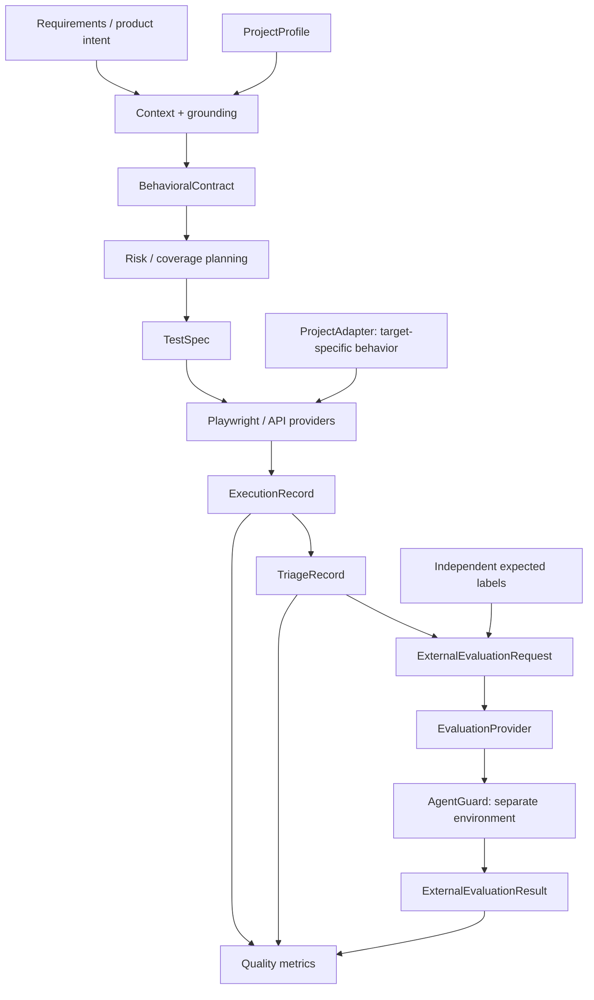

# AutoQE

**Governed Quality Engineering orchestration, from product intent to independently evaluated evidence.**

AutoQE is a vendor-neutral autonomous Quality Engineering orchestration framework
that converts product intent into grounded behavioral contracts, performs
risk-based test planning, produces vendor-neutral executable TestSpecs, delegates
execution to existing UI/API testing technologies, captures structured evidence,
performs deterministic triage, measures QE effectiveness, and supports independent
external evaluation. V1 demonstrates this chain using approved replay outputs,
a bounded reference adapter, Playwright and httpx—not live LLM calls.

**Reading path:** [project overview](docs/PROJECT_OVERVIEW.md) ->
[architecture](docs/ARCHITECTURE.md) -> [guided demonstration](docs/DEMO_GUIDE.md).
The [published artifacts](examples/demo/README.md) provide an inspectable example chain.

## The problem

Generating more test scripts does not establish that the right risks were tested,
that expected behavior came from a requirement, or that a failure is a product
defect. QE needs a traceable connection between intent, coverage decisions,
observations and conclusions. AutoQE makes those handoffs explicit and reviewable.

Traditional test generation often mixes planning with executable code. AutoQE
uses **TestSpec as the governed boundary**: typed semantic steps, expected outcomes,
layer and evidence requirements. It generates neither arbitrary Python nor
Playwright code. Existing testing technologies remain the execution engines.

## Architecture



Metrics observe artifacts; they do not control execution. External evaluation
receives selected artifacts and independent expectations, not a generated quality
score. The frozen core chain is `ProjectProfile → BehavioralContract → TestSpec →
ExecutionRecord → TriageRecord`.

## Core capabilities and workflow

1. Load approved Markdown requirements through a requirement provider.
2. Ground a replay-produced BehavioralContract in source IDs/fingerprints.
3. Plan risk/coverage-oriented TestSpecs with explicit unknowns.
4. Resolve supported actions through the RWA adapter; execute UI, API or BOTH
   with deterministic reset and assertion completeness checks.
5. Capture bounded observations and evidence in an ExecutionRecord.
6. Classify failures from evidence, retaining UNKNOWN when support is insufficient.
7. Compute metrics and optionally evaluate triage agreement through an external provider.

The components and CLIs are composable; v1 is not a production autonomous daemon.
The supported RWA action vocabulary is deliberately bounded.

## Demonstrated results

These are **historical, bounded qualification populations**, not estimates of
production-scale effectiveness. M8 republishes reviewed evidence; it does not
claim a new live qualification run.

| Evidence window | Observed result | Scope |
|---|---|---|
| [M3 healthy reference](docs/M3_EXECUTION_PROVIDERS.md) | UI 3/3, API 3/3, BOTH 3/3 | Three consecutive runs per selected scenario |
| [M4 controlled faults](docs/M4_CONTROLLED_FAULTS_AND_TRIAGE.md) | 3/3 detected; paired healthy baselines 3/3 passed | Three isolated payment regressions |
| [M5 metrics](docs/M5_QUALITY_METRICS.md) | Traceability 1/1; schema validity 3/3; executability 6/9; healthy false positives 0/3 | One payment requirement; distinct denominators |
| M5 triage / completion | Classification agreement 8/8; artifact completion 11/11 | Includes two synthetic triage-only cases; completion is not correctness |
| [M6 external evaluation](docs/M6_EXTERNAL_EVALUATION.md) | Real evaluation population 8: 8 PASS, 0 FAIL, 0 ERROR, 0 INCOMPLETE | Classification agreement only; includes synthetic evidence cases |
| M6 controls | Positive passes; deliberate negative fails | Two controls excluded from the eight-case metric |
| [M7 fresh-checkout validation](docs/M7_CI_CD.md) | 372 deterministic tests passed | Historical local checkpoint; current CI status is summarized below |
| M8 final checkout validation | 399 deterministic tests passed; 1.0.0 wheel validated | Adds cleanup/demo tests; no new live target qualification |

Qualification used **zero live model calls** and separate RWA and AgentGuard
environments. Static examples retain limitations and original producer metadata.
There are no statistical significance or comprehensive AI-reasoning claims.

## Reference application

The v1 target is the [Cypress Real World App](https://github.com/cypress-io/cypress-realworld-app),
pinned at `9dfcb9869533ce8a8963c556facc0d80457f9d39`. RWA is a reference target,
not AutoQE's identity. Its Cypress suite remains independent benchmark evidence
and is **not generation or planning context**. Cypress is not an implemented
AutoQE execution provider; current providers are Playwright and httpx.

## Quick start: no target, credential or model required

Use Python 3.13 from a full Git checkout. PowerShell:

```powershell
py -3.13 -m venv .venv
.venv/Scripts/python.exe -m pip install ".[test]"
.venv/Scripts/python.exe -m autoqe.cli.extract_contract `
  --project-profile examples/rwa/project-profile.json `
  --requirements examples/rwa/requirements/payments.md `
  --provider replay --output reports/demo/contract.json
.venv/Scripts/python.exe scripts/plan_tests.py `
  --project-profile examples/rwa/project-profile.json `
  --contract examples/rwa/plans/contracts/payment.json --provider replay --output reports/demo/plans
```

The planner uses its approved contract checkpoint: the fresh extraction differs
by a historical limitation string, so its exact replay fingerprint does not match.
This is an explicit v1 fixture limitation, not a silent live-model fallback.
These commands produce a grounded contract and three payment TestSpecs, not a successful
execution. Inspect [static evidence](examples/demo/README.md) without installing
browsers or starting external applications. For the complete suite, Node 22 is
also needed for one loopback-preload test:

```powershell
.venv/Scripts/python.exe -B -m pytest -q -p no:cacheprovider
```

## Guided demo

[DEMO_GUIDE.md](docs/DEMO_GUIDE.md) walks through REQ-PAY-001 slowly. Its default
artifact tour is self-contained. Optional live steps require provisioned external
repositories, isolated RWA and runtime-only credentials. Playwright is headless;
the guide distinguishes manual browser observation from automation evidence.

## Key design decisions

| Decision | Engineering reason |
|---|---|
| Frozen typed contracts | Stable, validated handoffs |
| TestSpec instead of generated code | Deterministic execution capability and safety checks |
| ProjectAdapter | Target setup/reset/authentication stays outside orchestration logic |
| Replay ModelProvider | Repeat approved outputs without model variability or cost |
| Explicit UNKNOWN / unavailable states | Missing evidence cannot become a pass or invented score |
| Evidence-first triage | Infer only categories supported by observations |
| External evaluation | Separate observed behavior from independent expected labels |

Model-provider interfaces support future live implementations. V1 CLIs explicitly
reject `--provider live`; replay is never described as a live LLM call. Each defect
belongs in the correct architectural layer, with attention to false positives and
negatives, determinism, evidence, regression risk and maintainability.

## AutoQE and AgentGuard

AutoQE asks: **Can AI-enabled orchestration perform useful QE work?** AgentGuard
asks: **Can we independently evaluate whether an AI/agent system is behaving
correctly and reliably?**

The flow is `ExternalEvaluationRequest → EvaluationProvider →
AgentGuardEvaluationProvider → isolated AgentGuard environment →
ExternalEvaluationResult`. AgentGuard is the first provider, not a core dependency.
Its qualified revision is `ee104f90fe9c0c23f320ab110fdd2c9adf20d37c`. The implemented
dimension is **triage-classification agreement**, not comprehensive evaluation of
planning, rationale, screenshots or all AutoQE reasoning.

## CI/CD

GitHub-hosted CI has passed on the latest master checkpoint.

The [workflow](.github/workflows/ci.yml) installs Python 3.13 dependencies, checks
compilation/imports, runs tests and architectural guards, builds/validates a wheel
and imports it after installation. PRs, pushes to `master` and manual dispatch
use read-only repository permissions. No target credentials, browser downloads,
RWA or real AgentGuard are needed. **CI PASS is not full real-world RWA/AgentGuard
qualification.** See [local reproduction](docs/M7_CI_CD.md).

## Security, privacy and reproducibility

Execution is loopback-only; no firewall changes, public binds, tunnels or remote
debugging. `RWA_TEST_PASSWORD` exists only at runtime. API evidence excludes raw
bodies, headers and cookies. Public examples omit screenshots and label projections.

Tracked source/fixtures define inputs. Ignored `reports/` contains local outputs,
not public proof or planning context. `qualification/` contains separate controllers
and fixtures; fault identities/expected labels must not enter runtime triage.
Dependency ranges are not a locked supply chain. See the
[public release review](docs/PUBLIC_RELEASE_REVIEW.md).

Report cleanup is opt-in and defaults to dry run:

```powershell
.venv/Scripts/python.exe scripts/cleanup_reports.py --older-than-days 30
.venv/Scripts/python.exe scripts/cleanup_reports.py --older-than-days 30 --confirm
# Preview everything; add --confirm only after review:
.venv/Scripts/python.exe scripts/cleanup_reports.py --all
```

The utility keeps the reports root, refuses links/junctions and protected nested
source/checkouts/venvs. Stop writers first; preserve needed evidence before deletion.

## Implemented v1 and intentionally deferred v2

| Implemented v1 | Deferred; not implemented |
|---|---|
| Grounded extraction/context; BehavioralContract | Live-model production qualification; richer exploration |
| Risk planning; vendor-neutral TestSpec | RAG, MCP/tool ecosystems, multi-agent QE |
| Bounded UI/API execution; structured evidence | Visual AI, self-healing, performance/security/accessibility adapters |
| Deterministic triage; controlled fault qualification | Richer semantic planning/rationale evaluation |
| Quality metrics; external evaluation; AgentGuard provider | Production analytics, enterprise gateways/APIs |
| Deterministic CI; reproducible replay; guided demo | Jira/TestRail/observability, dashboards, cloud deployment |

## Repository structure

```text
src/autoqe/          Core contracts, extraction, planning, adapters, execution, triage, metrics
autoqe_integration/  Generic contracts, external providers, local transport
examples/           Approved inputs/replays, synthetic fixtures, sanitized demo
qualification/      Separate qualification controllers and fixtures
scripts/            CLIs, wheel verification, opt-in report cleanup
tests/              Deterministic suite and architecture guards
docs/               Architecture, demo, milestone contracts and handoff
.github/workflows/  Standard self-contained CI
reports/            Ignored runtime output; never packaged
```

## Known limitations and release status

One reference app and a small behavior vocabulary are qualified. Unknown payment
policy stays unknown. Transaction assertions do not establish ledger correctness.
Triage trusts normalized evidence; hashes identify bytes rather than authenticate
an oracle. The evaluator worker is not an OS sandbox. Small populations cannot
establish production-scale effectiveness.

Package version: **1.0.0**. AutoQE is licensed under the [Apache License 2.0](LICENSE).
The repository is public and hosted CI has passed; the v1.0.0 tag/release has not
been created. Frozen schema and historical producer versions stay unchanged.

Supporting engineering evidence: [current handoff](docs/PROJECT_HANDOFF.md),
[qualification history](docs/QUALIFICATION_HISTORY.md),
[public release review](docs/PUBLIC_RELEASE_REVIEW.md),
[release readiness](docs/RELEASE_READINESS.md) and [changelog](CHANGELOG.md).
Individual qualification documents above retain the detailed experiment scope.
