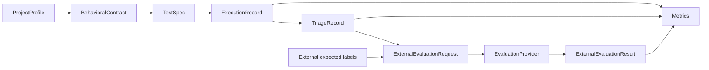
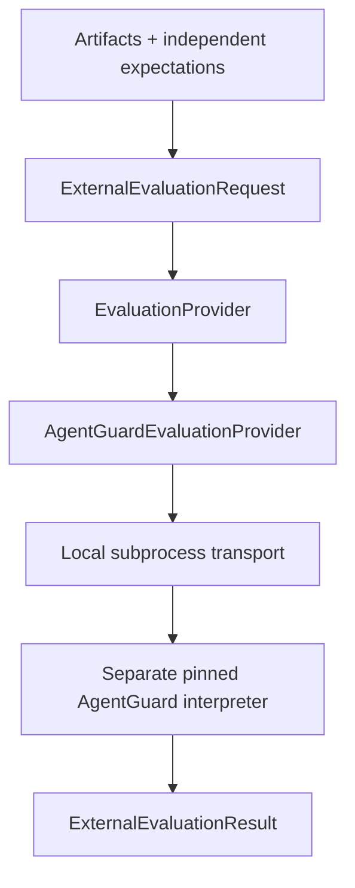

# AutoQE v1 architecture

AutoQE orchestrates QE through governed artifacts. It does not replace execution
frameworks or generate arbitrary executable code. RWA is the first adapter target;
AgentGuard is the first external evaluator. Neither defines core contracts.

## Responsibilities and boundaries

| Component | Responsibility | Boundary |
|---|---|---|
| Contracts/interfaces/schemas | Frozen M0 definitions | Never changed for implementation convenience |
| Requirements/context/extraction | Approved Markdown and grounded structured output | No RWA Cypress generation context |
| ModelProvider / replay | Validated approved extraction/planning outputs | Replay offline; live CLI mode unimplemented |
| Planning | Bounded risk/coverage scenarios and layers | TestSpecs, not code or executions |
| ProjectAdapter / RWA | Pin/readiness/reset/actors/authentication/capabilities | Target-specific behavior; loopback only |
| Resolver / execution providers | Supported semantic steps to UI/API operations | Unknown capabilities explicit; no eval/exec |
| Triage | Classify normalized evidence | No controller labels, target code or metric feedback |
| Metrics | Explicit denominators and availability | Reporting only; no execution feedback |
| Integration contracts | Request/result/window and EvaluationProvider protocol | No AutoQE internals or AgentGuard semantics |
| AgentGuard provider / transport | Pin and invoke separate evaluator process | No AgentGuard dependency in AutoQE |
| Qualification | Isolated experiments, labels, post-run joins | Outside installed runtime/model context |

## Contract and evidence chain

ProjectProfile declares target/capabilities, not credentials. BehavioralContract
retains source fingerprints, acceptance criteria, forbidden behaviors and unknowns.
TestSpec holds risk, layer, semantic steps, outcomes and evidence requirements.
ExecutionRecord preserves statuses and observations. TriageRecord links back to
that execution and its evidence.

Setup identity and assertion IDs matter as much as final status. Outcomes cannot
silently disappear or pass unresolved. BOTH runs providers sequentially with fresh
setup per half; errors dominate failures, which dominate passes. A supported
mismatch can identify a defect even when another provider stops early.

Payment checks cover amount in minor units, identity, participants, type/state
and counts—not ledger reconciliation. API evidence contains bounded measurements,
not unrestricted payloads. UI evidence can contain synthetic-state screenshots;
the public static demo omits them.

## Triage and metrics

Categories are PRODUCT_DEFECT, TEST_DEFECT, ENVIRONMENT_FAILURE, DATA_FAILURE,
UNSUPPORTED_BEHAVIOR and UNKNOWN. Product inference requires supported semantics,
verified setup, meaningful execution and a referenced mismatch. Insufficient
evidence remains UNKNOWN; healthy executions also use UNKNOWN with a no-failure
explanation because M0 has no healthy category. Triage does not inspect screenshots
or infer component root cause.

Metrics select explicit artifacts, external labels and corroborating checks.
AVAILABLE, UNAVAILABLE and NOT_APPLICABLE are distinct. Missing telemetry is not
zero; missing planned evaluations cannot vanish from the denominator. Completion
is not correctness. M5 imports only generic integration contracts; extraction,
planning, execution and triage do not depend on metrics.

## External evaluation

AgentGuard `ee104f90fe9c0c23f320ab110fdd2c9adf20d37c` is qualified for classification
agreement. Only the worker imports its scorer. The provider checks clean/pinned
state, interpreter separation, request identity and result consistency. Two controls
are excluded from the eight-case metric. Native tool checks with no tool calls do
not prove AutoQE tool-selection quality; semantic reasoning is not evaluated.

Transport uses an allowlisted environment, timeout and output-size checks; guards
block live/network paths. These controls are not an OS sandbox, and output is
size-checked after capture. External oracle truth is trusted; hashes are not signatures.

## CI and security

[Standard CI](M7_CI_CD.md) installs Python 3.13 dependencies, runs the complete
suite and frozen-tree/import guards, validates the wheel and imports it installed.
Node supports the loopback test. Only `autoqe` and `autoqe_integration` roots ship;
qualification fixtures are checkout test inputs, not wheel contents.

Execution permits localhost/127.0.0.1/::1. Process-scoped preload plus listener
inspection enforce local RWA demonstrations. No firewall changes, remote debugging
or tunnels. Credentials are runtime-only. Standard CI invokes neither real target
nor evaluator. Source, ignored reports and external labels have separate trust
roles; public copies/projections are labeled.

Package `1.0.0` does not mutate frozen schema `1.0`, its legacy default producer
metadata, or historical component producer versions. Those values describe
artifact provenance, not the installed distribution version.

## FUTURE: transports and richer capabilities

REST/events/queues/object storage/MCP are extension possibilities, not services.
A future gateway requires authentication, authorization and replay/privacy controls.
[M6 design notes](M6_EXTERNAL_EVALUATION.md) do not constitute production API
infrastructure. Live-model qualification, broader adapters and semantic evaluation
remain deferred; see the [v1/v2 table](../README.md).
