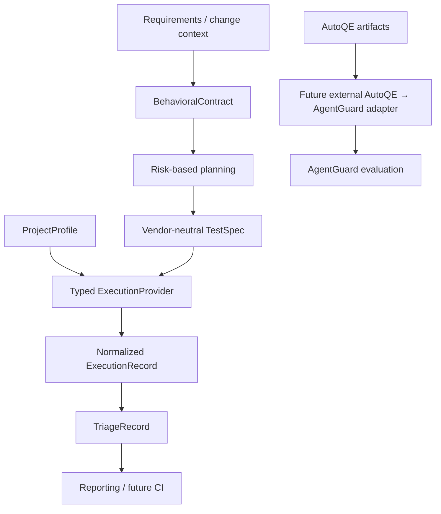

# M0 Architecture and Contracts

This document records the milestone scope. See [Architecture](ARCHITECTURE.md)
for the completed v1 implementation.

## Scope and lifecycle

AutoQE v1 is project-agnostic. Project behavior is described by `ProjectProfile` and future deterministic `ProjectAdapter` implementations. Behavioral intent is represented separately from execution intent. LLMs, when introduced in a later milestone, may produce validated structured records only; they do not emit arbitrary executable Python, JavaScript, or shell.

`TestSpec` is the handoff between structured planning and deterministic providers. Providers translate semantic actions into their own execution mechanics. Playwright and pytest/httpx are the planned initial ecosystems; no provider is implemented in M0. Existing Cypress RWA tests are an independent oracle and benchmark, never generation input.

## Contract lifecycle

1. `ProjectProfile` identifies requirements sources, app endpoints, runtime, reset/auth capabilities, contract references, and a pinned target.
2. `BehavioralContract` captures requirements, risks, conditions, expected/forbidden behavior, transitions, assumptions, and unknowns without selectors or API paths.
3. `TestSpec` expresses vendor-neutral semantic actions, expected outcomes, test data, evidence, cleanup, risk, and traceability.
4. `ExecutionRecord` normalizes provider status, step/assertion results, observed outcomes, safe evidence references, and reset/environment identities.
5. `TriageRecord` classifies only supported evidence; `UNKNOWN` is the default when a cause is not established.

All persisted records carry schema version and provenance. JSON Schemas are generated from the Pydantic v2 models by `scripts/export_schemas.py`.

## ProjectProfile boundary

Profiles explain how AutoQE can interact with a target, not its business rules. The RWA example records the qualified commit, Node 22.20.0 upstream pin, accepted Node range, qualified Node 22.23.3 variance, Yarn version, local UI/API URLs, reset identity, and observed UI/API capabilities. No payment logic is placed in the profile. `LOCAL_ONLY` profiles reject non-loopback endpoints; the generic contract still allows a future profile to declare `REMOTE_ALLOWED`.

## TestSpec and execution boundary

TestSpec steps use enumerated semantic actions and typed fields. They cannot contain provider code or unknown fields. `ExecutionProvider` only specifies `supports` and `execute`; it does not run browsers, APIs, or commands in M0. `ProjectAdapter` exposes narrow reset, data-setup, and authentication operations without an implementation.

## AgentGuard external artifact boundary

AgentGuard remains independent. A future external adapter may map selected AutoQE artifacts into a purpose-built AgentGuard dataset/record; it must not label Cypress execution records as AgentGuard `EvaluationRecord` instances. Candidate deterministic inputs include requirement/test/step IDs, normalized status, assertion outcomes, failure category, provenance, and sanitized evidence references. Semantic evaluation could assess whether a triage summary is supported by those records, but must not replace missing deterministic evidence or infer unsupported root cause. Reporter/ArtifactStore integration is not implemented.

TestSpec plus provenance is sufficient planning evidence for the v1 MVP: it retains the selected risk, priority, intent, traceability, semantic steps, expected outcomes, and evidence requirements. A separate PlanningRecord is deferred unless reviewed use cases require rejected alternatives or richer planning rationale.

## Privacy and security

Persistent models reject unknown fields and credential-bearing key names, including passwords, tokens, cookies, headers, API keys, and raw request/response bodies. Common credential-shaped sentinels are rejected. Store sanitized evidence references and hashes, not full private payloads. The reference/demo environment may bind only to `localhost`, `127.0.0.1`, or `::1`; do not configure LAN/public listeners, firewall exceptions, port forwarding, tunnels, or remote debugging. Do not modify Windows Firewall. This is a reference-environment policy, not a restriction on future enterprise target profiles.

## Versioning and offline/live strategy

Persistent contract `schema_version` starts at `1.0`. Additive optional fields may remain compatible; semantic breaking changes require a new major version, and consumers reject unsupported versions. There is no migration tooling. `ModelProvider` is an interface only; future live and replay/offline implementations must return schema-valid structured output. M0 performs no model calls.

## Explicit exclusions

No workflow/planner, executor, agent, RAG, MCP, multi-agent orchestration, self-healing, visual/accessibility/security/performance testing, CI/CD, Jira integration, telemetry feedback loop, or AgentGuard runtime dependency is introduced. No RWA service or test is run by the contract suite.