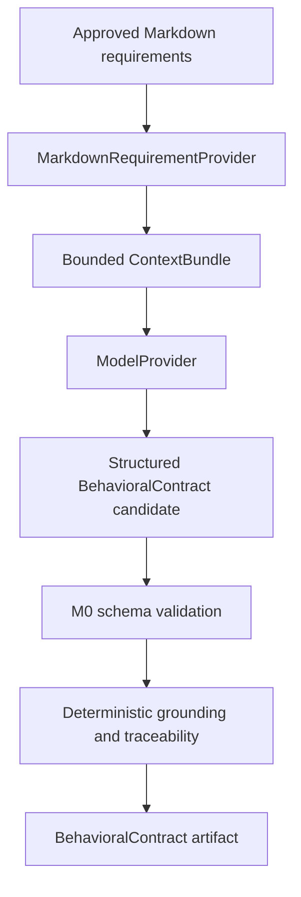

# M1 Context and Behavioral Contracts

## Flow



## Ingestion and context

`MarkdownRequirementProvider` reads only explicitly requested `.md` files under locations allowed by `ProjectProfile`. It rejects unsupported providers, non-Markdown paths, files outside the allowlist, oversized inputs, duplicate IDs, and RWA `cypress/` paths. The five committed RWA examples are synthetic/reference requirements, not copied from application test source.

`ContextBundle` is the complete bounded input to one extraction: project ID, normalized requirement sources, fingerprints, and limitations. M1 caps a request at ten files, 32 KiB per file, and 64 KiB total. It does not browse repositories or include API/source excerpts, secrets, test source, or defect metadata.

## Fingerprints and replay

Markdown is normalized to Unicode NFC, LF newlines, trimmed trailing whitespace, and one final newline before SHA-256. Replay entries match task, project, source IDs, and exact fingerprints; changed input has no approved replay and fails clearly. Replay output is labeled `autoqe-replay`; it never represents a live model response.

The `ModelProvider` protocol remains the future boundary. No OpenAI SDK/provider was added: there is no approved live-provider dependency in the frozen M0 package, and a live implementation is unnecessary to qualify deterministic ingestion, schema validation, and grounding. `--provider live` fails closed in M1.

## Extraction and grounding

Extraction validates the profile/context project IDs, asks the provider for structured output using the M0 BehavioralContract JSON Schema, validates the result with the frozen Pydantic model, and checks requirement IDs, source IDs, content fingerprints, risk level, and source-backed fields. Substantive claims must exactly match the corresponding normalized source statements. This conservative check avoids a second model judge and does not claim full semantic truth verification. Existing M0 record-level `source_ids` and `source_fingerprints` remain unchanged; no contract redesign was needed.

`unknowns` remain distinct from `assumptions`. Explicit source unknowns must be retained; assumptions are separately labeled and counted. Missing information is never promoted to a behavioral assertion. The quality report exposes schema validity, requirement traceability, source-reference validity, unknown/assumption counts, source-backed claim count, and the overall grounding result; it is descriptive, not a release gate.

## Benchmark leakage and next boundary

RWA Cypress files are independent benchmark evidence and are rejected by the RWA profile allowlist and path check. No Cypress assertion or test implementation is loaded by extraction. M2 may introduce TestSpec planning from approved BehavioralContracts; it must continue to keep benchmark sources outside generation context. RAG, Jira/Confluence, and other requirement sources remain future extensions, not M1 providers.

## Offline demonstration

From the repository root after installing the editable package:

```powershell
.venv/Scripts/python.exe -m autoqe.cli.extract_contract `
  --project-profile examples/rwa/project-profile.json `
  --requirements examples/rwa/requirements/payments.md `
  --provider replay `
  --output reports/contracts
```

The generated report is local and ignored by Git. This command performs no browser, API, application, or live-model calls.