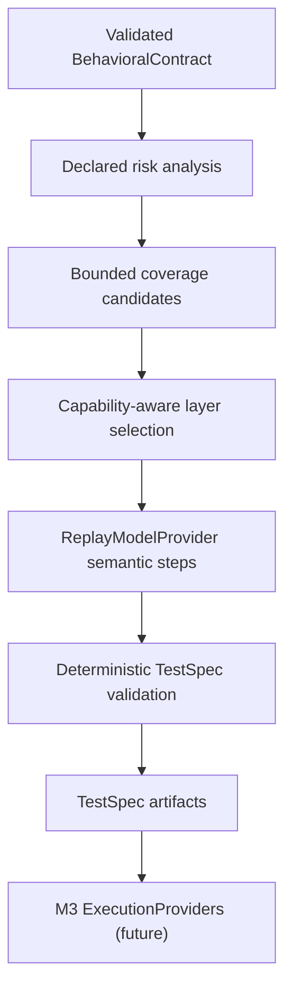

# M2 Risk-Based Planning

## Flow



## Risk and coverage

Risk remains the contract's declared `RiskLevel`; M2 never upgrades or downgrades it and estimates no probabilities. Priority is deterministic: CRITICAL 1, HIGH 2, MEDIUM 3, LOW 4, UNKNOWN 5. Structural flags report authorization constraints, transaction-related language, data-integrity wording, forbidden behavior, state transitions, and assumptions/unknowns. These flags guide coverage ordering, not a new risk score.

Coverage groups contract-backed expected behaviors into a positive scenario, forbidden behaviors into negative scenarios, authorization constraints into authorization scenarios, and declared transitions into state-transition scenarios. A boundary scenario is created only for an explicit numeric/comparative condition. Each behavior group produces at most one scenario of its category. The default maximum is five TestSpecs; the configured maximum is bounded to ten, and omitted lower-priority scenarios are reported.

## Layer selection

Layer choice is deterministic and uses only `ProjectProfile.execution_capabilities`. High/critical positive transaction workflows use BOTH when UI and API are both available; direct negative, authorization, and boundary checks prefer API. UI is selected for a positive scenario only when the contract explicitly signals visible/review interaction; otherwise direct API evidence is preferred. State transitions prefer BOTH for high-risk contracts and otherwise API. If a preferred capability is unavailable, the selector uses an available layer or fails if neither exists. Unsupported provider layers are rejected.

## Replay and TestSpec

The existing `ReplayModelProvider` handles `plan_test_specs` as a separate task. Its approved fixture matches a SHA-256 of the complete planning context and output schema; unknown or changed inputs fail closed. Replay responses provide only typed semantic steps. Risk, coverage, layer, expected outcomes, test data needs, evidence requests, traceability, and provenance are assembled or validated deterministically. TestSpecs contain no selectors, API implementation, shell, or provider code.

TestSpec rationale is not a field in the frozen M0 contract. An internal `PlanningSummary` carries scenario/layer rationales and deterministic coverage metrics; the CLI persists it as a runtime `planning-summary.json` artifact under ignored `reports/plans/`. It is not a frozen M0 record. Unknowns are copied to that summary and each TestSpec's limitations; they are not converted into expected behavior. No PlanningRecord is introduced.

## Grounding and privacy

The planner consumes only a validated BehavioralContract, the profile's execution capabilities, bounded planning configuration, and replay output. It does not reread Markdown or inspect application/test source. Validation checks project/contract/requirement IDs, source IDs and fingerprints, exact expected outcomes, scenario-category evidence, layer availability, maximum count, semantic-action fields, and contract unknown preservation. Privacy-safe M0 models remain authoritative.

RWA plans are based on committed M1 BehavioralContract examples from approved replay responses. Cypress files/assertions, controlled defect metadata, and expected benchmark results are not planning inputs. RAG, MCP, CI/CD, live models, and execution providers remain outside M2. M3 owns execution.

## Offline command

From the repository root after installing the editable package:

```powershell
.venv/Scripts/python.exe scripts/plan_tests.py `
  --project-profile examples/rwa/project-profile.json `
  --contract examples/rwa/plans/contracts/payment.json `
  --provider replay
```

The CLI writes TestSpecs and `planning-summary.json` under `reports/plans/<contract_id>/`. It does not start RWA or execute a test.
