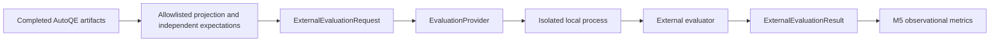

# M6 external evaluation

M6 is an observational integration boundary. It evaluates already-produced
artifacts without changing extraction, planning, execution or triage. It does not
implement M7, release gates, an overall score, semantic judges or runtime feedback.

## Ownership and contracts



`autoqe_integration/contracts` owns version 1.0 of the request, result, planned window and
`EvaluationProvider.evaluate(request) -> result` protocol. These are external
integration contracts, not frozen M0 artifacts. They import no AutoQE internals
and name no concrete evaluator. M5 imports only these generic contracts; runtime
modules import neither metrics nor integrations. Packaging includes the top-level
`autoqe_integration` package, without adding an evaluator dependency to `pyproject.toml`.

Requests contain project/window IDs, an opaque evaluation UUID, dimension, actual
and expected values, independent expectation provenance, source artifact IDs and
byte hashes, requirement/source lineage, evidence hashes, source kind, control
flag, and the `classification-only-v1` privacy projection identity. Provenance has
an opaque source UUID, source hash, label UUID and acquisition method. Integration
UUIDs identify projections/labels; they do not invent missing source artifact IDs.

Results preserve the complete sanitized request and its canonical hash, provider
identity/revision/version, status, attempted flag, nullable passed value, unchanged
native result, applicability, bounded error codes and limitations. Provider
revisions are opaque identifiers: Git revisions are the first provider's choice,
not a constraint imposed on future providers. Source roles and the dimension are
bounded in v1; new dimensions require deliberate contract evolution.

The contracts use strict validation and reject extra fields, unknown versions,
unsafe export fields, invalid identities and nonfinite/duplicate JSON values.
Serialization sorts keys and omits nondeterministic timestamps. Transport paths,
executables and commands are absent from the contracts. Result file byte hashes
are retained by M5; request hashes bind each result to the planned population.

## First provider: AgentGuard

`autoqe_integration/providers/agentguard` qualifies against
`ee104f90fe9c0c23f320ab110fdd2c9adf20d37c` only. The provider verifies HEAD and a
clean working tree before invocation and again afterward; the worker independently
checks HEAD. Revision mismatch, dirty checkout or missing environment cannot
become a completed evaluation. No checkout/reset/install is attempted.

The worker calls only `src.agentguard.scoring.evaluate_record`:

| Generic field | Native projection |
|---|---|
| evaluation_case_id | scenario.id / ScenarioScore.scenario_id |
| expected_value | the single scenario.expected_contains value |
| actual_value | captured record.final_output |
| No applicable agent-tool trace | empty expected_tools and tool_calls collections |

The captured record is a minimal structural view (`final_output`, `tool_calls`),
not a fabricated support-agent execution. No latency, tool results, model/prompt
IDs, usage, planning or runtime telemetry are invented. AgentGuard's callable
scorer accepts this view at the pinned revision. This is a qualified internal
function boundary, not a claim of a public stable SDK or generic dataset-loader
support.

Before invocation, both values must be exactly one of PRODUCT_DEFECT, TEST_DEFECT,
ENVIRONMENT_FAILURE, DATA_FAILURE, UNSUPPORTED_BEHAVIOR or UNKNOWN. Whitespace,
prose, empty values, multiple labels and unknown values are rejected. Expectation
provenance and valid identities are mandatory. With this closed enum, no valid
label is contained in another; the native containment check represents label
agreement without admitting empty-expectation or surrounding-prose passes.

The native dataclass is serialized directly with `asdict`; its fields and failure
messages are preserved. The provider checks native shape, identity and internal
consistency, but does not substitute its own classification judgment. Native
tool/argument flags may be true for empty collections; applicability explicitly
excludes these dimensions from AutoQE evaluation claims.

## Local-process transport and isolation

`autoqe_integration/transport/local_process.py` implements JSON over stdin/stdout, an
explicit executable and fixed worker path, argument lists with `shell=False`, a
bounded timeout (default 20 seconds, maximum 60), 64 KiB payload/output limits,
sanitized errors and no forwarded stderr. Captured output is size-checked after
process completion; this is not a hostile-process memory/resource sandbox.

AutoQE and AgentGuard retain separate Python environments. The provider rejects
using its own Python executable as the evaluator interpreter. The worker runs
with `-I -B`, no inherited PYTHONPATH, no bytecode writes, and an environment
allowlist containing only OS/runtime essentials. Model credentials, proxies,
RWA_TEST_PASSWORD and arbitrary caller settings are not forwarded. No `.env` is
loaded by the selected import path.

Worker guards prohibit imports of the support-agent runtime, execution-record
runner, semantic evaluator, agents SDK, OpenAI SDK and DeepEval. Socket connection,
binding, UDP send and DNS entry points are denied. The selected deterministic
scorer import path uses none of those capabilities. These controls protect the
qualified path; they are not OS isolation against malicious evaluator code.

## Exactly one evaluated dimension

`triage_classification_agreement` compares actual triage classification with an
independent externally established expected label. This repeats the narrow label
agreement property already observed by M5, now through a real independent
evaluator invocation and separately attributable results.

AgentGuard does NOT independently establish contract grounding, planning quality,
full execution integrity, triage rationale, screenshots, comprehensive privacy,
operational SLOs, model/prompt regression or release readiness. Schema/linkage and
privacy validation are adapter prerequisites, not additional AgentGuard scores.
No full native support-agent lineage, quality gate or safety aggregate is used.

## Population, expectations and privacy

The CLI reads two explicit files: captured projections and independent labels.
`qualification/m6/fixtures/evidence.json` preserves the previously qualified
classification and source IDs/hashes. `expectations.json` retains external labels
and the original external qualification source hash. The initial real population
was derived from the externally labeled M4/M5 cases, including two explicitly
synthetic triage-evidence cases; its size is not hardcoded. Those two remain part
of the historical labeled population and are distinct from new provider controls.

Positive and negative controls have `qualification_only=true` and synthetic
provenance. Their small source artifacts and independent expectation definition
are retained. `.gitattributes` preserves LF bytes for hashed committed fixtures.
All fixtures are sanitized projections, not copies of entire runtime reports.
Historical original artifacts remain optional audit sources, not unit-test or
fresh-checkout dependencies. Projection hashes identify original bytes; they do
not authenticate the external oracle or prove full underlying runtime correctness.

Actual classifications were copied from TriageRecords; expected labels were
copied separately from external qualification metadata and corroborated against
the M4 summary. Neither comes from the other. The adapter preserves requirement,
contract, test, execution and triage IDs, source fingerprints and evidence hashes.
No missing source identifiers are filled in. Evidence paths are not sent to the
worker; hashes and original artifact identities support local audit joins.

Whole M4 reports, M5 manifests, ExecutionRecords and TriageRecords are never
forwarded. Worker requests exclude fault IDs, patch descriptions, source changes,
worktree paths, credentials, cookies, headers, raw authentication and bodies.
Evaluation/expectation IDs are opaque; profile names are not embedded in them.
Native scorer failure text can contain only the validated enum values in this
projection. Independent expected labels are evaluation oracle inputs, not hidden
fault-profile identity.

## Completion and M5 accounting

| Status | Meaning |
|---|---|
| COMPLETED_PASS | Invocation completed and the valid native score passed |
| COMPLETED_FAIL | Invocation completed and the valid native score failed |
| ERROR | Attempted invocation/evaluator/protocol failed; passed is null |
| INCOMPLETE | Planned evaluation could not be completed reliably, including missing/unqualified environment; passed is null |

`ExternalEvaluationWindow` records the planned case UUIDs, request hashes, control
flags, provider/revision, project/window and dimension before execution starts.
M5 accepts only generic normalized results plus this explicit plan. Duplicate or
unplanned results, identity/digest contradictions and completed results from an
unqualified revision fail clearly. Missing result entries/files remain missing
in the planned window; malformed present results are rejected.

The AgentGuard metric numerator is real COMPLETED_PASS results; denominator is
real COMPLETED_PASS plus COMPLETED_FAIL results. It also reports planned,
attempted, completed, passed, failed, error, incomplete, missing and excluded
control counts. Missing real cases count as incomplete. Any real ERROR,
INCOMPLETE or missing case makes the headline value UNAVAILABLE, even when the
completed subset all passed. Controls never enter the numerator or denominator.
An empty population or absent external evidence also remains UNAVAILABLE.

Control failures are inspected by the qualification harness separately; they do
not corrupt the real metric population. A qualification PASS means the controls
behaved correctly and the real evaluation window completed. It is not a release
gate or a requirement that an arbitrary real population achieve a chosen rate.
Real classification failures remain completed results and contribute to the rate.

## Commands and reproducibility

With existing separate environments, no installation or RWA startup is needed:

```powershell
.venv/Scripts/python.exe -B scripts/qualify_m6.py `
  --evidence qualification/m6/fixtures/evidence.json `
  --expectations qualification/m6/fixtures/expectations.json `
  --evaluator-root ../AgentGuard `
  --evaluator-python ../AgentGuard/.venv/Scripts/python.exe `
  --output reports/m6-qualification

.venv/Scripts/python.exe -B scripts/report_quality_metrics.py `
  --evidence-manifest reports/m6-qualification/metrics-manifest.json `
  --output reports/m6-metrics

.venv/Scripts/python.exe -B -m pytest tests/test_external_evaluation.py tests/test_metrics.py tests/test_contracts.py -q -p no:cacheprovider
```

Use a new output directory; qualification never overwrites an earlier window.
It writes normalized results, an incrementally retained planned metrics manifest,
a quality report and a qualification summary. Unit tests require neither the
AgentGuard checkout nor old reports. Real provider qualification requires the
explicit separate pinned checkout/environment and invokes the actual scorer for
each request. A CLI input/output error is exit 2; incomplete qualification is exit
1; completed qualification is exit 0. No live model or RWA call is performed.

## Future secure API architecture — NOT IMPLEMENTED

The same request/result JSON contracts can later travel over HTTPS/REST, message
queues, an event bus, object storage, MCP or enterprise integration gateways.
Only transport and concrete provider implementations should change.

Future flow: external client -> HTTPS/TLS -> integration gateway -> authentication
and scoped authorization -> schema/version and payload validation -> allowlisted
projection/secret filtering and hashing -> provider routing -> EvaluationProvider.

The gateway would own payload-size limits, rate limits, audit logging, correlation
IDs, replay protection/idempotency where appropriate, version negotiation and
least-privilege access. Potential authentication includes OAuth2/OIDC, service
accounts, short-lived tokens and appropriate service-to-service mTLS. Proposed
scopes are `autoqe.artifacts.read`, `autoqe.evaluations.submit`,
`autoqe.evaluations.read` and `autoqe.results.write`; callers receive only the
scopes and artifact subsets necessary for their role. Sensitive source artifacts
remain behind field-level projection; authentication does not authorize indiscriminate
export.

M6 implements no REST server, auth service, API gateway, database, broker, cloud
deployment, event transport or MCP integration. A future enterprise, commercial or
governance evaluator can implement the same protocol, retain its own native
evidence and use an independent transport without changing AutoQE runtime. No
placeholder providers are included.

## Qualified result

M6 qualified successfully on 2026-10-01 using AutoQE Python 3.13.7 and AgentGuard
Python 3.11.5 in separate existing environments. Final output is ignored under
`reports/m6-qualification` and `reports/m6-metrics`.

- Positive control: COMPLETED_PASS; negative control: COMPLETED_FAIL.
- Real labeled population: 8 planned, 8 attempted, 8 completed pass, 0 completed
  fail, 0 error, 0 incomplete/missing. Two controls excluded from the metric.
- Ten native ScenarioScores retained; M5 external metric AVAILABLE at 8/8.
- 75 focused M6 tests; 148 combined M6/metrics/contracts tests passed, including
  a fresh-checkout-style copy with no historical reports or `.git` directory.
- One complete AutoQE suite: 354 passed. Wheel construction and isolated target
  imports also passed. No evaluator installation was added to AutoQE's environment.
- Source hashes, independent expectation provenance, request/result linkage,
  deterministic report serialization and privacy/fault-identity audits passed.
- Zero live model calls, no RWA startup, no listeners on 3000/3001; both external
  repositories remained clean at their pinned revisions. Frozen M0 and AutoQE
  runtime layers were unchanged. This qualification covered M6 only.
